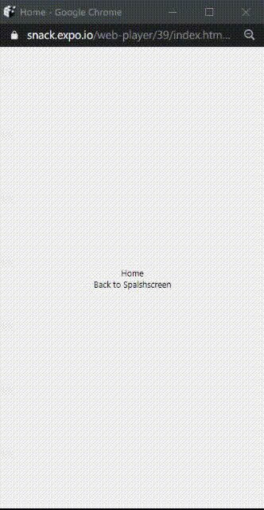

[Back to main page](../readme.md)

## Guide For

> #### React-Navigation And Stack Navigator
> Set up core navigation and create basic app navigation with stack navigator.

### Installation
```
npm install @react-navigation/native
```

#### Installing dependencies into a bare React Native project
```
npm install react-native-reanimated react-native-gesture-handler react-native-screens react-native-safe-area-context @react-native-community/masked-view
```
If you're on a Mac and developing for iOS, you need to install the pods (via Cocoapods) to complete the linking.
```
npx pod-install ios
```

#### Installing Stack Navigator
```
npm install @react-navigation/stack
```

#### To finalize installation of react-native-gesture-handler, add the following at the top (make sure it's at the top and there's nothing else before it) of your entry file, such as index.js or App.js:
```
import 'react-native-gesture-handler'
```

#### Usage
>for sample usage you can follow [this example link](https://snack.expo.io/NoESwzTmJ)


